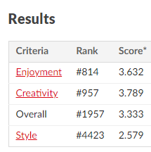

# The Nested Squares

This game was made for the GMTK 2024 Game Jam

Theme: "Built to Scale"

It was made in pygame on the fourth and final day after I gave up on game engines.

Game's result in the game jam with 7635 entries in the jam.

The game can be played here: https://codingismagic.itch.io/the-nested-squares